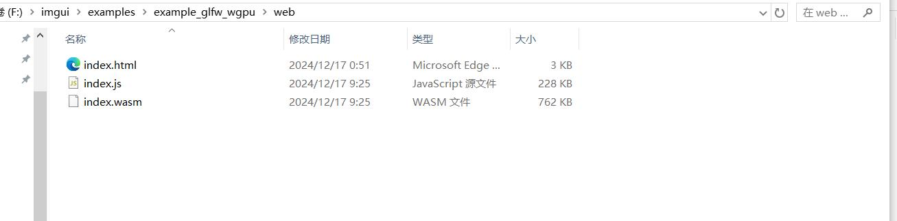
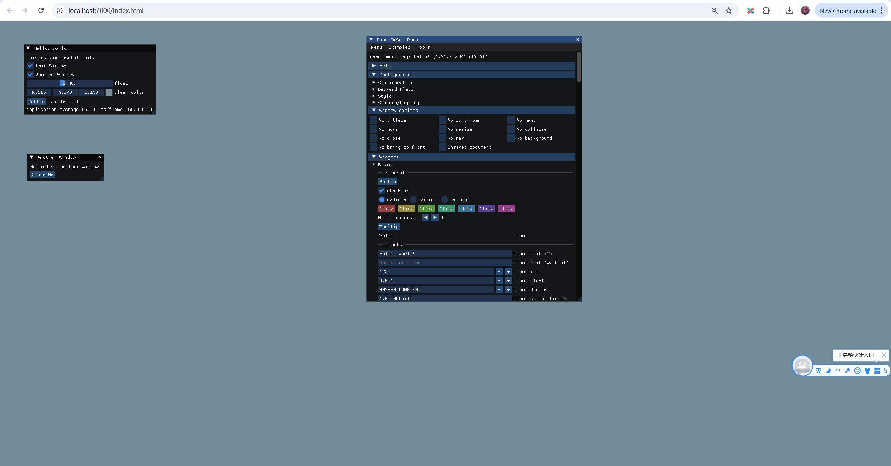

## 编译imgui

官方文档：`https://github.com/ocornut/imgui/tree/master/examples/example_glfw_wgpu`

### 1. 编译

做任何操作前，先设置好环境变量：

```
F:\>cd emsdk

F:\emsdk>emsdk_env.bat
```

因为需要用`make`命令，但是我是在window上，就用了clion自带的`mingw32-make.exe`。

```
F:\webassembly_book\files\imgui\examples\example_glfw_wgpu>"C:\Program Files\JetBrains\CLion 2023.3.4\bin\mingw\bin\mingw32-make.exe" -f Makefile.emscripten
process_begin: CreateProcess(NULL, uname -s, ...) failed.
Makefile.emscripten:25: pipe: No error
em++ -DIMGUI_DISABLE_FILE_FUNCTIONS -I../.. -I../../backends -Wall -Wformat -Os -s DISABLE_EXCEPTION_CATCHING=1  -c -o main.o main.cpp
em++ -DIMGUI_DISABLE_FILE_FUNCTIONS -I../.. -I../../backends -Wall -Wformat -Os -s DISABLE_EXCEPTION_CATCHING=1  -c -o imgui.o ../../imgui.cpp
em++ -DIMGUI_DISABLE_FILE_FUNCTIONS -I../.. -I../../backends -Wall -Wformat -Os -s DISABLE_EXCEPTION_CATCHING=1  -c -o imgui_demo.o ../../imgui_demo.cpp
em++ -DIMGUI_DISABLE_FILE_FUNCTIONS -I../.. -I../../backends -Wall -Wformat -Os -s DISABLE_EXCEPTION_CATCHING=1  -c -o imgui_draw.o ../../imgui_draw.cpp
em++ -DIMGUI_DISABLE_FILE_FUNCTIONS -I../.. -I../../backends -Wall -Wformat -Os -s DISABLE_EXCEPTION_CATCHING=1  -c -o imgui_tables.o ../../imgui_tables.cpp
em++ -DIMGUI_DISABLE_FILE_FUNCTIONS -I../.. -I../../backends -Wall -Wformat -Os -s DISABLE_EXCEPTION_CATCHING=1  -c -o imgui_widgets.o ../../imgui_widgets.cpp
em++ -DIMGUI_DISABLE_FILE_FUNCTIONS -I../.. -I../../backends -Wall -Wformat -Os -s DISABLE_EXCEPTION_CATCHING=1  -c -o imgui_impl_glfw.o ../../backends/imgui_impl_glfw.cpp
em++ -DIMGUI_DISABLE_FILE_FUNCTIONS -I../.. -I../../backends -Wall -Wformat -Os -s DISABLE_EXCEPTION_CATCHING=1  -c -o imgui_impl_wgpu.o ../../backends/imgui_impl_wgpu.cpp
mkdir web
em++ -o web/index.js main.o imgui.o imgui_demo.o imgui_draw.o imgui_tables.o imgui_widgets.o imgui_impl_glfw.o imgui_impl_wgpu.o -s USE_GLFW=3 -s USE_WEBGPU=1 -s WASM=1 -s ALLOW_MEMORY_GROWTH=1 -s NO_EXIT_RUNTIME=0 -s ASSERTIONS=1 -s NO_FILESYSTEM=1 -s DISABLE_EXCEPTION_CATCHING=1
Build complete for web/index.js

F:\webassembly_book\files\imgui\examples\example_glfw_wgpu>
```

得到需要的文件



这里有个奇怪的问题，第二次build的时候就没有`index.html`这个文件了，所以自己保存一份复制过来好了。

### 2. 测试

进入web目录，启动http服务器：

```
F:\webassembly_book\files\imgui\examples\example_glfw_wgpu\web>emrun index.html --port 7000
Now listening at http://0.0.0.0:7000/
```

会自动打开浏览器访问，如下图，imgui在浏览器中运行起来了。

