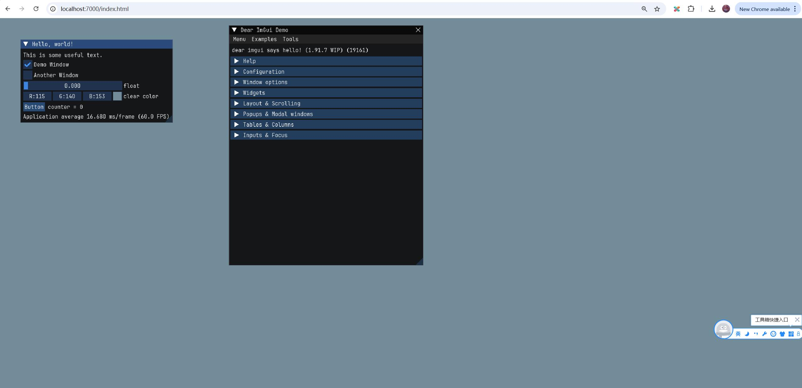

## 字体模糊

用imgui自带的example编译到网页后，字体很模糊。

到Github找了一个比较清晰的：`https://github.com/jnmaloney/WebGui`

在线演示：`https://jnmaloney.github.io/WebGui/imgui.html`

把它复制到`F:\webassembly_book\files\imgui\examples\WebGui`，和其他示例放到一起。

然后把`files\imgui\examples\example_glfw_wgpu\Makefile.emscripten`复制过来，再把自带的`files\imgui\examples\WebGui\Makefile`的一些配置挪过来。

编译，然后启动http服务器，看看效果。

