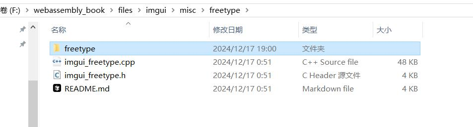
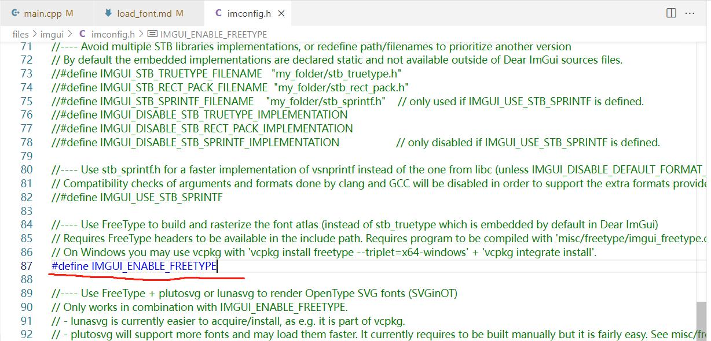
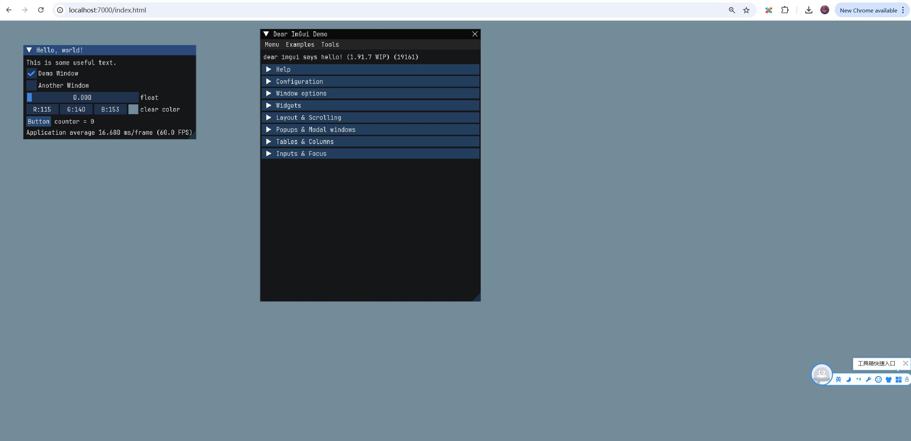

## 使用freetype

如果要显示中文，那么就得使用freetype。

### 1. 复制源码

复制freetype源码到misc目录



### 2. 开启freetype

修改`files\imgui\imconfig.h`，开启freetype。

```c++
//---- Use FreeType to build and rasterize the font atlas (instead of stb_truetype which is embedded by default in Dear ImGui)
// Requires FreeType headers to be available in the include path. Requires program to be compiled with 'misc/freetype/imgui_freetype.cpp' (in this repository) + the FreeType library (not provided).
// On Windows you may use vcpkg with 'vcpkg install freetype --triplet=x64-windows' + 'vcpkg integrate install'.
#define IMGUI_ENABLE_FREETYPE
```



<font color=red>注意：</font> 有些ttf字体文件加载进来会崩溃，可能是因为不支持AutoHint。

修改`ftobjs.c`，强制设置False。

```c++
FT_EXPORT_DEF( FT_Error )
FT_Load_Glyph( FT_Face   face,
                FT_UInt   glyph_index,
                FT_Int32  load_flags )
{

......

      autohint = FALSE;//强制设置为False

    if ( autohint )
    {
      FT_AutoHinter_Interface  hinting;

      ......
    }
    ......
  }
```

在出现崩溃之前，在Load字体文件时，其实就有一些错误了，只是没有提示出来。

```c++
///file:ttpload.c

/**************************************************************************
   *
   * @Function:
   *   tt_face_load_prep
   *
   * @Description:
   *   Load the cvt program.
   *
   * @InOut:
   *   face ::
   *     A handle to the target face object.
   *
   * @Input:
   *   stream ::
   *     A handle to the input stream.
   *
   * @Return:
   *   FreeType error code.  0 means success.
   */
  FT_LOCAL_DEF( FT_Error )
  tt_face_load_prep( TT_Face    face,
                     FT_Stream  stream )
  {
#ifdef TT_USE_BYTECODE_INTERPRETER

    FT_Error  error;
    FT_ULong  table_len;


    FT_TRACE2(( "Prep program " ));

    error = face->goto_table( face, TTAG_prep, stream, &table_len ); //有问题的字体会返回error
    if ( error )
    {
      face->cvt_program      = NULL;
      face->cvt_program_size = 0;
      error                  = FT_Err_Ok;

      FT_TRACE2(( "is missing\n" ));
    }
    else
    {
      face->cvt_program_size = table_len;
      if ( FT_FRAME_EXTRACT( table_len, face->cvt_program ) )
        goto Exit;

      FT_TRACE2(( "loaded, %12ld bytes\n", face->cvt_program_size ));
    }

  Exit:
    return error;

#else /* !TT_USE_BYTECODE_INTERPRETER */

    FT_UNUSED( face   );
    FT_UNUSED( stream );

    return FT_Err_Ok;

#endif
  }
```

错误日志没有输出，可以在`CMakeLists.txt.FreeType`中开启。

```CMake
add_definitions(-D FT_DEBUG_LEVEL_TRACE)
```

### 3. 修改编译规则

修改`files\imgui\examples\example_glfw_wgpu\Makefile.emscripten`，引入`imgui_freetype`

```
SOURCES += $(IMGUI_DIR)/misc/freetype/imgui_freetype.cpp
```

然后引入freetype源码

```
SOURCES += $(IMGUI_DIR)/misc/freetype/freetype/src/autofit/autofit.c
SOURCES += $(IMGUI_DIR)/misc/freetype/freetype/src/base/ftbase.c
SOURCES += $(IMGUI_DIR)/misc/freetype/freetype/src/base/ftbbox.c
SOURCES += $(IMGUI_DIR)/misc/freetype/freetype/src/base/ftbdf.c
SOURCES += $(IMGUI_DIR)/misc/freetype/freetype/src/base/ftbitmap.c
SOURCES += $(IMGUI_DIR)/misc/freetype/freetype/src/base/ftcid.c
SOURCES += $(IMGUI_DIR)/misc/freetype/freetype/src/base/ftfstype.c
SOURCES += $(IMGUI_DIR)/misc/freetype/freetype/src/base/ftgasp.c
SOURCES += $(IMGUI_DIR)/misc/freetype/freetype/src/base/ftglyph.c
SOURCES += $(IMGUI_DIR)/misc/freetype/freetype/src/base/ftgxval.c
SOURCES += $(IMGUI_DIR)/misc/freetype/freetype/src/base/ftinit.c
SOURCES += $(IMGUI_DIR)/misc/freetype/freetype/src/base/ftmm.c
SOURCES += $(IMGUI_DIR)/misc/freetype/freetype/src/base/ftotval.c
SOURCES += $(IMGUI_DIR)/misc/freetype/freetype/src/base/ftpatent.c
SOURCES += $(IMGUI_DIR)/misc/freetype/freetype/src/base/ftpfr.c
SOURCES += $(IMGUI_DIR)/misc/freetype/freetype/src/base/ftstroke.c
SOURCES += $(IMGUI_DIR)/misc/freetype/freetype/src/base/ftsynth.c
SOURCES += $(IMGUI_DIR)/misc/freetype/freetype/src/base/fttype1.c
SOURCES += $(IMGUI_DIR)/misc/freetype/freetype/src/base/ftwinfnt.c
SOURCES += $(IMGUI_DIR)/misc/freetype/freetype/src/bdf/bdf.c
SOURCES += $(IMGUI_DIR)/misc/freetype/freetype/src/bzip2/ftbzip2.c
SOURCES += $(IMGUI_DIR)/misc/freetype/freetype/src/cache/ftcache.c
SOURCES += $(IMGUI_DIR)/misc/freetype/freetype/src/cff/cff.c
SOURCES += $(IMGUI_DIR)/misc/freetype/freetype/src/cid/type1cid.c
SOURCES += $(IMGUI_DIR)/misc/freetype/freetype/src/gzip/ftgzip.c
SOURCES += $(IMGUI_DIR)/misc/freetype/freetype/src/lzw/ftlzw.c
SOURCES += $(IMGUI_DIR)/misc/freetype/freetype/src/pcf/pcf.c
SOURCES += $(IMGUI_DIR)/misc/freetype/freetype/src/pfr/pfr.c
SOURCES += $(IMGUI_DIR)/misc/freetype/freetype/src/psaux/psaux.c
SOURCES += $(IMGUI_DIR)/misc/freetype/freetype/src/pshinter/pshinter
SOURCES += $(IMGUI_DIR)/misc/freetype/freetype/src/psnames/psnames.c
SOURCES += $(IMGUI_DIR)/misc/freetype/freetype/src/raster/raster.c
SOURCES += $(IMGUI_DIR)/misc/freetype/freetype/src/sdf/sdf.c
SOURCES += $(IMGUI_DIR)/misc/freetype/freetype/src/sfnt/sfnt.c
SOURCES += $(IMGUI_DIR)/misc/freetype/freetype/src/smooth/smooth.c
SOURCES += $(IMGUI_DIR)/misc/freetype/freetype/src/truetype/truetype
SOURCES += $(IMGUI_DIR)/misc/freetype/freetype/src/type1/type1.c
SOURCES += $(IMGUI_DIR)/misc/freetype/freetype/src/type42/type42.c
SOURCES += $(IMGUI_DIR)/misc/freetype/freetype/src/winfonts/winfnt.c
SOURCES += $(IMGUI_DIR)/misc/freetype/freetype/src/base/ftsystem.c
SOURCES += $(IMGUI_DIR)/misc/freetype/freetype/src/base/ftdebug.c
```

包含头文件目录

```
CPPFLAGS += -I$(IMGUI_DIR)/misc/freetype/include
CPPFLAGS += -I$(IMGUI_DIR)/misc/freetype/freetype
CPPFLAGS += -I$(IMGUI_DIR)/misc/freetype/freetype/include
CPPFLAGS += -I$(IMGUI_DIR)/misc/freetype/freetype/include/freetype
CPPFLAGS += -I$(IMGUI_DIR)/misc/freetype/freetype/config
CPPFLAGS += -I$(IMGUI_DIR)/misc/freetype/freetype/internal
CPPFLAGS += -I$(IMGUI_DIR)/misc/freetype/freetype/src/autofit
```

添加FreeType预定义

```
CPPFLAGS += -DFT2_BUILD_LIBRARY
```

添加编译规则

```
%.o:$(IMGUI_DIR)/misc/freetype/%.cpp
	$(CXX) $(CPPFLAGS) $(CXXFLAGS) -c -o $@ $<

## FreeType编译规则
%.o:$(IMGUI_DIR)/misc/freetype/freetype/src/*/%.c
	$(CXX) $(CPPFLAGS) $(CXXFLAGS) -c -o $@ $<
```

### 4. 编译

然后清理掉web目录的`index.js` `index.wasm` ，然后清理掉编译目录的`.o`文件，然后编译。

```log
F:\webassembly_book\files\imgui\examples\example_glfw_wgpu>"C:\Program Files\JetBrains\CLion 2023.3.4\bin\mingw\bin\mingw32-make.exe" -f Makefile.emscripten
process_begin: CreateProcess(NULL, uname -s, ...) failed.
Makefile.emscripten:71: pipe: No error
em++ -I../.. -I../../backends -I../../misc/freetype -I../../misc/freetype/include -I../../misc/freetype/freetype -I../../misc/freetype/freetype/include -I../../misc/freetype/freetype/include/freetype -I../../misc/freetype/freetype/config -I../../misc/freetype/freetype/internal -I../../misc/freetype/freetype/src/autofit -DFT2_BUILD_LIBRARY -Wall -Wformat -Os -s DISABLE_EXCEPTION_CATCHING=1  -c -o main.o main.cpp
em++ -I../.. -I../../backends -I../../misc/freetype -I../../misc/freetype/include -I../../misc/freetype/freetype -I../../misc/freetype/freetype/include -I../../misc/freetype/freetype/include/freetype -I../../misc/freetype/freetype/config -I../../misc/freetype/freetype/internal -I../../misc/freetype/freetype/src/autofit -DFT2_BUILD_LIBRARY -Wall -Wformat -Os -s DISABLE_EXCEPTION_CATCHING=1  -c -o imgui.o ../../imgui.cpp
em++ -I../.. -I../../backends -I../../misc/freetype -I../../misc/freetype/include -I../../misc/freetype/freetype -I../../misc/freetype/freetype/include -I../../misc/freetype/freetype/include/freetype -I../../misc/freetype/freetype/config -I../../misc/freetype/freetype/internal -I../../misc/freetype/freetype/src/autofit -DFT2_BUILD_LIBRARY -Wall -Wformat -Os -s DISABLE_EXCEPTION_CATCHING=1  -c -o imgui_demo.o ../../imgui_demo.cpp
em++ -I../.. -I../../backends -I../../misc/freetype -I../../misc/freetype/include -I../../misc/freetype/freetype -I../../misc/freetype/freetype/include -I../../misc/freetype/freetype/include/freetype -I../../misc/freetype/freetype/config -I../../misc/freetype/freetype/internal -I../../misc/freetype/freetype/src/autofit -DFT2_BUILD_LIBRARY -Wall -Wformat -Os -s DISABLE_EXCEPTION_CATCHING=1  -c -o imgui_draw.o ../../imgui_draw.cpp
em++ -I../.. -I../../backends -I../../misc/freetype -I../../misc/freetype/include -I../../misc/freetype/freetype -I../../misc/freetype/freetype/include -I../../misc/freetype/freetype/include/freetype -I../../misc/freetype/freetype/config -I../../misc/freetype/freetype/internal -I../../misc/freetype/freetype/src/autofit -DFT2_BUILD_LIBRARY -Wall -Wformat -Os -s DISABLE_EXCEPTION_CATCHING=1  -c -o imgui_tables.o ../../imgui_tables.cpp
em++ -I../.. -I../../backends -I../../misc/freetype -I../../misc/freetype/include -I../../misc/freetype/freetype -I../../misc/freetype/freetype/include -I../../misc/freetype/freetype/include/freetype -I../../misc/freetype/freetype/config -I../../misc/freetype/freetype/internal -I../../misc/freetype/freetype/src/autofit -DFT2_BUILD_LIBRARY -Wall -Wformat -Os -s DISABLE_EXCEPTION_CATCHING=1  -c -o imgui_widgets.o ../../imgui_widgets.cpp
em++ -I../.. -I../../backends -I../../misc/freetype -I../../misc/freetype/include -I../../misc/freetype/freetype -I../../misc/freetype/freetype/include -I../../misc/freetype/freetype/include/freetype -I../../misc/freetype/freetype/config -I../../misc/freetype/freetype/internal -I../../misc/freetype/freetype/src/autofit -DFT2_BUILD_LIBRARY -Wall -Wformat -Os -s DISABLE_EXCEPTION_CATCHING=1  -c -o imgui_impl_glfw.o ../../backends/imgui_impl_glfw.cpp
em++ -I../.. -I../../backends -I../../misc/freetype -I../../misc/freetype/include -I../../misc/freetype/freetype -I../../misc/freetype/freetype/include -I../../misc/freetype/freetype/include/freetype -I../../misc/freetype/freetype/config -I../../misc/freetype/freetype/internal -I../../misc/freetype/freetype/src/autofit -DFT2_BUILD_LIBRARY -Wall -Wformat -Os -s DISABLE_EXCEPTION_CATCHING=1  -c -o imgui_impl_wgpu.o ../../backends/imgui_impl_wgpu.cpp
em++ -I../.. -I../../backends -I../../misc/freetype -I../../misc/freetype/include -I../../misc/freetype/freetype -I../../misc/freetype/freetype/include -I../../misc/freetype/freetype/include/freetype -I../../misc/freetype/freetype/config -I../../misc/freetype/freetype/internal -I../../misc/freetype/freetype/src/autofit -DFT2_BUILD_LIBRARY -Wall -Wformat -Os -s DISABLE_EXCEPTION_CATCHING=1  -c -o imgui_freetype.o ../../misc/freetype/imgui_freetype.cpp
../../misc/freetype/imgui_freetype.cpp:172:42: warning: first argument in call to 'memset' is a pointer to non-trivially copyable type
      '(anonymous namespace)::FreeTypeFont' [-Wnontrivial-memcall]
  172 |         FreeTypeFont()          { memset(this, 0, sizeof(*this)); }
      |                                          ^
../../misc/freetype/imgui_freetype.cpp:172:42: note: explicitly cast the pointer to silence this warning
  172 |         FreeTypeFont()          { memset(this, 0, sizeof(*this)); }
      |                                          ^
      |                                          (void*)
1 warning generated.
em++ -I../.. -I../../backends -I../../misc/freetype -I../../misc/freetype/include -I../../misc/freetype/freetype -I../../misc/freetype/freetype/include -I../../misc/freetype/freetype/include/freetype -I../../misc/freetype/freetype/config -I../../misc/freetype/freetype/internal -I../../misc/freetype/freetype/src/autofit -DFT2_BUILD_LIBRARY -Wall -Wformat -Os -s DISABLE_EXCEPTION_CATCHING=1  -c -o autofit.o ../../misc/freetype/freetype/src/autofit/autofit.c
clang++: warning: treating 'c' input as 'c++' when in C++ mode, this behavior is deprecated [-Wdeprecated]
em++ -I../.. -I../../backends -I../../misc/freetype -I../../misc/freetype/include -I../../misc/freetype/freetype -I../../misc/freetype/freetype/include -I../../misc/freetype/freetype/include/freetype -I../../misc/freetype/freetype/config -I../../misc/freetype/freetype/internal -I../../misc/freetype/freetype/src/autofit -DFT2_BUILD_LIBRARY -Wall -Wformat -Os -s DISABLE_EXCEPTION_CATCHING=1  -c -o ftbase.o ../../misc/freetype/freetype/src/base/ftbase.c
clang++: warning: treating 'c' input as 'c++' when in C++ mode, this behavior is deprecated [-Wdeprecated]
em++ -I../.. -I../../backends -I../../misc/freetype -I../../misc/freetype/include -I../../misc/freetype/freetype -I../../misc/freetype/freetype/include -I../../misc/freetype/freetype/include/freetype -I../../misc/freetype/freetype/config -I../../misc/freetype/freetype/internal -I../../misc/freetype/freetype/src/autofit -DFT2_BUILD_LIBRARY -Wall -Wformat -Os -s DISABLE_EXCEPTION_CATCHING=1  -c -o ftbbox.o ../../misc/freetype/freetype/src/base/ftbbox.c
clang++: warning: treating 'c' input as 'c++' when in C++ mode, this behavior is deprecated [-Wdeprecated]
em++ -I../.. -I../../backends -I../../misc/freetype -I../../misc/freetype/include -I../../misc/freetype/freetype -I../../misc/freetype/freetype/include -I../../misc/freetype/freetype/include/freetype -I../../misc/freetype/freetype/config -I../../misc/freetype/freetype/internal -I../../misc/freetype/freetype/src/autofit -DFT2_BUILD_LIBRARY -Wall -Wformat -Os -s DISABLE_EXCEPTION_CATCHING=1  -c -o ftbdf.o ../../misc/freetype/freetype/src/base/ftbdf.c
clang++: warning: treating 'c' input as 'c++' when in C++ mode, this behavior is deprecated [-Wdeprecated]
em++ -I../.. -I../../backends -I../../misc/freetype -I../../misc/freetype/include -I../../misc/freetype/freetype -I../../misc/freetype/freetype/include -I../../misc/freetype/freetype/include/freetype -I../../misc/freetype/freetype/config -I../../misc/freetype/freetype/internal -I../../misc/freetype/freetype/src/autofit -DFT2_BUILD_LIBRARY -Wall -Wformat -Os -s DISABLE_EXCEPTION_CATCHING=1  -c -o ftbitmap.o ../../misc/freetype/freetype/src/base/ftbitmap.c
clang++: warning: treating 'c' input as 'c++' when in C++ mode, this behavior is deprecated [-Wdeprecated]
em++ -I../.. -I../../backends -I../../misc/freetype -I../../misc/freetype/include -I../../misc/freetype/freetype -I../../misc/freetype/freetype/include -I../../misc/freetype/freetype/include/freetype -I../../misc/freetype/freetype/config -I../../misc/freetype/freetype/internal -I../../misc/freetype/freetype/src/autofit -DFT2_BUILD_LIBRARY -Wall -Wformat -Os -s DISABLE_EXCEPTION_CATCHING=1  -c -o ftcid.o ../../misc/freetype/freetype/src/base/ftcid.c
clang++: warning: treating 'c' input as 'c++' when in C++ mode, this behavior is deprecated [-Wdeprecated]
em++ -I../.. -I../../backends -I../../misc/freetype -I../../misc/freetype/include -I../../misc/freetype/freetype -I../../misc/freetype/freetype/include -I../../misc/freetype/freetype/include/freetype -I../../misc/freetype/freetype/config -I../../misc/freetype/freetype/internal -I../../misc/freetype/freetype/src/autofit -DFT2_BUILD_LIBRARY -Wall -Wformat -Os -s DISABLE_EXCEPTION_CATCHING=1  -c -o ftfstype.o ../../misc/freetype/freetype/src/base/ftfstype.c
clang++: warning: treating 'c' input as 'c++' when in C++ mode, this behavior is deprecated [-Wdeprecated]
em++ -I../.. -I../../backends -I../../misc/freetype -I../../misc/freetype/include -I../../misc/freetype/freetype -I../../misc/freetype/freetype/include -I../../misc/freetype/freetype/include/freetype -I../../misc/freetype/freetype/config -I../../misc/freetype/freetype/internal -I../../misc/freetype/freetype/src/autofit -DFT2_BUILD_LIBRARY -Wall -Wformat -Os -s DISABLE_EXCEPTION_CATCHING=1  -c -o ftgasp.o ../../misc/freetype/freetype/src/base/ftgasp.c
clang++: warning: treating 'c' input as 'c++' when in C++ mode, this behavior is deprecated [-Wdeprecated]
em++ -I../.. -I../../backends -I../../misc/freetype -I../../misc/freetype/include -I../../misc/freetype/freetype -I../../misc/freetype/freetype/include -I../../misc/freetype/freetype/include/freetype -I../../misc/freetype/freetype/config -I../../misc/freetype/freetype/internal -I../../misc/freetype/freetype/src/autofit -DFT2_BUILD_LIBRARY -Wall -Wformat -Os -s DISABLE_EXCEPTION_CATCHING=1  -c -o ftglyph.o ../../misc/freetype/freetype/src/base/ftglyph.c
clang++: warning: treating 'c' input as 'c++' when in C++ mode, this behavior is deprecated [-Wdeprecated]
em++ -I../.. -I../../backends -I../../misc/freetype -I../../misc/freetype/include -I../../misc/freetype/freetype -I../../misc/freetype/freetype/include -I../../misc/freetype/freetype/include/freetype -I../../misc/freetype/freetype/config -I../../misc/freetype/freetype/internal -I../../misc/freetype/freetype/src/autofit -DFT2_BUILD_LIBRARY -Wall -Wformat -Os -s DISABLE_EXCEPTION_CATCHING=1  -c -o ftgxval.o ../../misc/freetype/freetype/src/base/ftgxval.c
clang++: warning: treating 'c' input as 'c++' when in C++ mode, this behavior is deprecated [-Wdeprecated]
em++ -I../.. -I../../backends -I../../misc/freetype -I../../misc/freetype/include -I../../misc/freetype/freetype -I../../misc/freetype/freetype/include -I../../misc/freetype/freetype/include/freetype -I../../misc/freetype/freetype/config -I../../misc/freetype/freetype/internal -I../../misc/freetype/freetype/src/autofit -DFT2_BUILD_LIBRARY -Wall -Wformat -Os -s DISABLE_EXCEPTION_CATCHING=1  -c -o ftinit.o ../../misc/freetype/freetype/src/base/ftinit.c
clang++: warning: treating 'c' input as 'c++' when in C++ mode, this behavior is deprecated [-Wdeprecated]
em++ -I../.. -I../../backends -I../../misc/freetype -I../../misc/freetype/include -I../../misc/freetype/freetype -I../../misc/freetype/freetype/include -I../../misc/freetype/freetype/include/freetype -I../../misc/freetype/freetype/config -I../../misc/freetype/freetype/internal -I../../misc/freetype/freetype/src/autofit -DFT2_BUILD_LIBRARY -Wall -Wformat -Os -s DISABLE_EXCEPTION_CATCHING=1  -c -o ftmm.o ../../misc/freetype/freetype/src/base/ftmm.c
clang++: warning: treating 'c' input as 'c++' when in C++ mode, this behavior is deprecated [-Wdeprecated]
em++ -I../.. -I../../backends -I../../misc/freetype -I../../misc/freetype/include -I../../misc/freetype/freetype -I../../misc/freetype/freetype/include -I../../misc/freetype/freetype/include/freetype -I../../misc/freetype/freetype/config -I../../misc/freetype/freetype/internal -I../../misc/freetype/freetype/src/autofit -DFT2_BUILD_LIBRARY -Wall -Wformat -Os -s DISABLE_EXCEPTION_CATCHING=1  -c -o ftotval.o ../../misc/freetype/freetype/src/base/ftotval.c
clang++: warning: treating 'c' input as 'c++' when in C++ mode, this behavior is deprecated [-Wdeprecated]
em++ -I../.. -I../../backends -I../../misc/freetype -I../../misc/freetype/include -I../../misc/freetype/freetype -I../../misc/freetype/freetype/include -I../../misc/freetype/freetype/include/freetype -I../../misc/freetype/freetype/config -I../../misc/freetype/freetype/internal -I../../misc/freetype/freetype/src/autofit -DFT2_BUILD_LIBRARY -Wall -Wformat -Os -s DISABLE_EXCEPTION_CATCHING=1  -c -o ftpatent.o ../../misc/freetype/freetype/src/base/ftpatent.c
clang++: warning: treating 'c' input as 'c++' when in C++ mode, this behavior is deprecated [-Wdeprecated]
em++ -I../.. -I../../backends -I../../misc/freetype -I../../misc/freetype/include -I../../misc/freetype/freetype -I../../misc/freetype/freetype/include -I../../misc/freetype/freetype/include/freetype -I../../misc/freetype/freetype/config -I../../misc/freetype/freetype/internal -I../../misc/freetype/freetype/src/autofit -DFT2_BUILD_LIBRARY -Wall -Wformat -Os -s DISABLE_EXCEPTION_CATCHING=1  -c -o ftpfr.o ../../misc/freetype/freetype/src/base/ftpfr.c
clang++: warning: treating 'c' input as 'c++' when in C++ mode, this behavior is deprecated [-Wdeprecated]
em++ -I../.. -I../../backends -I../../misc/freetype -I../../misc/freetype/include -I../../misc/freetype/freetype -I../../misc/freetype/freetype/include -I../../misc/freetype/freetype/include/freetype -I../../misc/freetype/freetype/config -I../../misc/freetype/freetype/internal -I../../misc/freetype/freetype/src/autofit -DFT2_BUILD_LIBRARY -Wall -Wformat -Os -s DISABLE_EXCEPTION_CATCHING=1  -c -o ftstroke.o ../../misc/freetype/freetype/src/base/ftstroke.c
clang++: warning: treating 'c' input as 'c++' when in C++ mode, this behavior is deprecated [-Wdeprecated]
em++ -I../.. -I../../backends -I../../misc/freetype -I../../misc/freetype/include -I../../misc/freetype/freetype -I../../misc/freetype/freetype/include -I../../misc/freetype/freetype/include/freetype -I../../misc/freetype/freetype/config -I../../misc/freetype/freetype/internal -I../../misc/freetype/freetype/src/autofit -DFT2_BUILD_LIBRARY -Wall -Wformat -Os -s DISABLE_EXCEPTION_CATCHING=1  -c -o ftsynth.o ../../misc/freetype/freetype/src/base/ftsynth.c
clang++: warning: treating 'c' input as 'c++' when in C++ mode, this behavior is deprecated [-Wdeprecated]
em++ -I../.. -I../../backends -I../../misc/freetype -I../../misc/freetype/include -I../../misc/freetype/freetype -I../../misc/freetype/freetype/include -I../../misc/freetype/freetype/include/freetype -I../../misc/freetype/freetype/config -I../../misc/freetype/freetype/internal -I../../misc/freetype/freetype/src/autofit -DFT2_BUILD_LIBRARY -Wall -Wformat -Os -s DISABLE_EXCEPTION_CATCHING=1  -c -o fttype1.o ../../misc/freetype/freetype/src/base/fttype1.c
clang++: warning: treating 'c' input as 'c++' when in C++ mode, this behavior is deprecated [-Wdeprecated]
em++ -I../.. -I../../backends -I../../misc/freetype -I../../misc/freetype/include -I../../misc/freetype/freetype -I../../misc/freetype/freetype/include -I../../misc/freetype/freetype/include/freetype -I../../misc/freetype/freetype/config -I../../misc/freetype/freetype/internal -I../../misc/freetype/freetype/src/autofit -DFT2_BUILD_LIBRARY -Wall -Wformat -Os -s DISABLE_EXCEPTION_CATCHING=1  -c -o ftwinfnt.o ../../misc/freetype/freetype/src/base/ftwinfnt.c
clang++: warning: treating 'c' input as 'c++' when in C++ mode, this behavior is deprecated [-Wdeprecated]
em++ -I../.. -I../../backends -I../../misc/freetype -I../../misc/freetype/include -I../../misc/freetype/freetype -I../../misc/freetype/freetype/include -I../../misc/freetype/freetype/include/freetype -I../../misc/freetype/freetype/config -I../../misc/freetype/freetype/internal -I../../misc/freetype/freetype/src/autofit -DFT2_BUILD_LIBRARY -Wall -Wformat -Os -s DISABLE_EXCEPTION_CATCHING=1  -c -o bdf.o ../../misc/freetype/freetype/src/bdf/bdf.c
clang++: warning: treating 'c' input as 'c++' when in C++ mode, this behavior is deprecated [-Wdeprecated]
em++ -I../.. -I../../backends -I../../misc/freetype -I../../misc/freetype/include -I../../misc/freetype/freetype -I../../misc/freetype/freetype/include -I../../misc/freetype/freetype/include/freetype -I../../misc/freetype/freetype/config -I../../misc/freetype/freetype/internal -I../../misc/freetype/freetype/src/autofit -DFT2_BUILD_LIBRARY -Wall -Wformat -Os -s DISABLE_EXCEPTION_CATCHING=1  -c -o ftbzip2.o ../../misc/freetype/freetype/src/bzip2/ftbzip2.c
clang++: warning: treating 'c' input as 'c++' when in C++ mode, this behavior is deprecated [-Wdeprecated]
em++ -I../.. -I../../backends -I../../misc/freetype -I../../misc/freetype/include -I../../misc/freetype/freetype -I../../misc/freetype/freetype/include -I../../misc/freetype/freetype/include/freetype -I../../misc/freetype/freetype/config -I../../misc/freetype/freetype/internal -I../../misc/freetype/freetype/src/autofit -DFT2_BUILD_LIBRARY -Wall -Wformat -Os -s DISABLE_EXCEPTION_CATCHING=1  -c -o ftcache.o ../../misc/freetype/freetype/src/cache/ftcache.c
clang++: warning: treating 'c' input as 'c++' when in C++ mode, this behavior is deprecated [-Wdeprecated]
em++ -I../.. -I../../backends -I../../misc/freetype -I../../misc/freetype/include -I../../misc/freetype/freetype -I../../misc/freetype/freetype/include -I../../misc/freetype/freetype/include/freetype -I../../misc/freetype/freetype/config -I../../misc/freetype/freetype/internal -I../../misc/freetype/freetype/src/autofit -DFT2_BUILD_LIBRARY -Wall -Wformat -Os -s DISABLE_EXCEPTION_CATCHING=1  -c -o cff.o ../../misc/freetype/freetype/src/cff/cff.c
clang++: warning: treating 'c' input as 'c++' when in C++ mode, this behavior is deprecated [-Wdeprecated]
em++ -I../.. -I../../backends -I../../misc/freetype -I../../misc/freetype/include -I../../misc/freetype/freetype -I../../misc/freetype/freetype/include -I../../misc/freetype/freetype/include/freetype -I../../misc/freetype/freetype/config -I../../misc/freetype/freetype/internal -I../../misc/freetype/freetype/src/autofit -DFT2_BUILD_LIBRARY -Wall -Wformat -Os -s DISABLE_EXCEPTION_CATCHING=1  -c -o type1cid.o ../../misc/freetype/freetype/src/cid/type1cid.c
clang++: warning: treating 'c' input as 'c++' when in C++ mode, this behavior is deprecated [-Wdeprecated]
em++ -I../.. -I../../backends -I../../misc/freetype -I../../misc/freetype/include -I../../misc/freetype/freetype -I../../misc/freetype/freetype/include -I../../misc/freetype/freetype/include/freetype -I../../misc/freetype/freetype/config -I../../misc/freetype/freetype/internal -I../../misc/freetype/freetype/src/autofit -DFT2_BUILD_LIBRARY -Wall -Wformat -Os -s DISABLE_EXCEPTION_CATCHING=1  -c -o ftgzip.o ../../misc/freetype/freetype/src/gzip/ftgzip.c
clang++: warning: treating 'c' input as 'c++' when in C++ mode, this behavior is deprecated [-Wdeprecated]
em++ -I../.. -I../../backends -I../../misc/freetype -I../../misc/freetype/include -I../../misc/freetype/freetype -I../../misc/freetype/freetype/include -I../../misc/freetype/freetype/include/freetype -I../../misc/freetype/freetype/config -I../../misc/freetype/freetype/internal -I../../misc/freetype/freetype/src/autofit -DFT2_BUILD_LIBRARY -Wall -Wformat -Os -s DISABLE_EXCEPTION_CATCHING=1  -c -o ftlzw.o ../../misc/freetype/freetype/src/lzw/ftlzw.c
clang++: warning: treating 'c' input as 'c++' when in C++ mode, this behavior is deprecated [-Wdeprecated]
em++ -I../.. -I../../backends -I../../misc/freetype -I../../misc/freetype/include -I../../misc/freetype/freetype -I../../misc/freetype/freetype/include -I../../misc/freetype/freetype/include/freetype -I../../misc/freetype/freetype/config -I../../misc/freetype/freetype/internal -I../../misc/freetype/freetype/src/autofit -DFT2_BUILD_LIBRARY -Wall -Wformat -Os -s DISABLE_EXCEPTION_CATCHING=1  -c -o pcf.o ../../misc/freetype/freetype/src/pcf/pcf.c
clang++: warning: treating 'c' input as 'c++' when in C++ mode, this behavior is deprecated [-Wdeprecated]
em++ -I../.. -I../../backends -I../../misc/freetype -I../../misc/freetype/include -I../../misc/freetype/freetype -I../../misc/freetype/freetype/include -I../../misc/freetype/freetype/include/freetype -I../../misc/freetype/freetype/config -I../../misc/freetype/freetype/internal -I../../misc/freetype/freetype/src/autofit -DFT2_BUILD_LIBRARY -Wall -Wformat -Os -s DISABLE_EXCEPTION_CATCHING=1  -c -o pfr.o ../../misc/freetype/freetype/src/pfr/pfr.c
clang++: warning: treating 'c' input as 'c++' when in C++ mode, this behavior is deprecated [-Wdeprecated]
em++ -I../.. -I../../backends -I../../misc/freetype -I../../misc/freetype/include -I../../misc/freetype/freetype -I../../misc/freetype/freetype/include -I../../misc/freetype/freetype/include/freetype -I../../misc/freetype/freetype/config -I../../misc/freetype/freetype/internal -I../../misc/freetype/freetype/src/autofit -DFT2_BUILD_LIBRARY -Wall -Wformat -Os -s DISABLE_EXCEPTION_CATCHING=1  -c -o psaux.o ../../misc/freetype/freetype/src/psaux/psaux.c
clang++: warning: treating 'c' input as 'c++' when in C++ mode, this behavior is deprecated [-Wdeprecated]
em++ -I../.. -I../../backends -I../../misc/freetype -I../../misc/freetype/include -I../../misc/freetype/freetype -I../../misc/freetype/freetype/include -I../../misc/freetype/freetype/include/freetype -I../../misc/freetype/freetype/config -I../../misc/freetype/freetype/internal -I../../misc/freetype/freetype/src/autofit -DFT2_BUILD_LIBRARY -Wall -Wformat -Os -s DISABLE_EXCEPTION_CATCHING=1  -c -o pshinter.o ../../misc/freetype/freetype/src/pshinter/pshinter.c
clang++: warning: treating 'c' input as 'c++' when in C++ mode, this behavior is deprecated [-Wdeprecated]
em++ -I../.. -I../../backends -I../../misc/freetype -I../../misc/freetype/include -I../../misc/freetype/freetype -I../../misc/freetype/freetype/include -I../../misc/freetype/freetype/include/freetype -I../../misc/freetype/freetype/config -I../../misc/freetype/freetype/internal -I../../misc/freetype/freetype/src/autofit -DFT2_BUILD_LIBRARY -Wall -Wformat -Os -s DISABLE_EXCEPTION_CATCHING=1  -c -o psnames.o ../../misc/freetype/freetype/src/psnames/psnames.c
clang++: warning: treating 'c' input as 'c++' when in C++ mode, this behavior is deprecated [-Wdeprecated]
em++ -I../.. -I../../backends -I../../misc/freetype -I../../misc/freetype/include -I../../misc/freetype/freetype -I../../misc/freetype/freetype/include -I../../misc/freetype/freetype/include/freetype -I../../misc/freetype/freetype/config -I../../misc/freetype/freetype/internal -I../../misc/freetype/freetype/src/autofit -DFT2_BUILD_LIBRARY -Wall -Wformat -Os -s DISABLE_EXCEPTION_CATCHING=1  -c -o raster.o ../../misc/freetype/freetype/src/raster/raster.c
clang++: warning: treating 'c' input as 'c++' when in C++ mode, this behavior is deprecated [-Wdeprecated]
em++ -I../.. -I../../backends -I../../misc/freetype -I../../misc/freetype/include -I../../misc/freetype/freetype -I../../misc/freetype/freetype/include -I../../misc/freetype/freetype/include/freetype -I../../misc/freetype/freetype/config -I../../misc/freetype/freetype/internal -I../../misc/freetype/freetype/src/autofit -DFT2_BUILD_LIBRARY -Wall -Wformat -Os -s DISABLE_EXCEPTION_CATCHING=1  -c -o sdf.o ../../misc/freetype/freetype/src/sdf/sdf.c
clang++: warning: treating 'c' input as 'c++' when in C++ mode, this behavior is deprecated [-Wdeprecated]
em++ -I../.. -I../../backends -I../../misc/freetype -I../../misc/freetype/include -I../../misc/freetype/freetype -I../../misc/freetype/freetype/include -I../../misc/freetype/freetype/include/freetype -I../../misc/freetype/freetype/config -I../../misc/freetype/freetype/internal -I../../misc/freetype/freetype/src/autofit -DFT2_BUILD_LIBRARY -Wall -Wformat -Os -s DISABLE_EXCEPTION_CATCHING=1  -c -o sfnt.o ../../misc/freetype/freetype/src/sfnt/sfnt.c
clang++: warning: treating 'c' input as 'c++' when in C++ mode, this behavior is deprecated [-Wdeprecated]
em++ -I../.. -I../../backends -I../../misc/freetype -I../../misc/freetype/include -I../../misc/freetype/freetype -I../../misc/freetype/freetype/include -I../../misc/freetype/freetype/include/freetype -I../../misc/freetype/freetype/config -I../../misc/freetype/freetype/internal -I../../misc/freetype/freetype/src/autofit -DFT2_BUILD_LIBRARY -Wall -Wformat -Os -s DISABLE_EXCEPTION_CATCHING=1  -c -o smooth.o ../../misc/freetype/freetype/src/smooth/smooth.c
clang++: warning: treating 'c' input as 'c++' when in C++ mode, this behavior is deprecated [-Wdeprecated]
em++ -I../.. -I../../backends -I../../misc/freetype -I../../misc/freetype/include -I../../misc/freetype/freetype -I../../misc/freetype/freetype/include -I../../misc/freetype/freetype/include/freetype -I../../misc/freetype/freetype/config -I../../misc/freetype/freetype/internal -I../../misc/freetype/freetype/src/autofit -DFT2_BUILD_LIBRARY -Wall -Wformat -Os -s DISABLE_EXCEPTION_CATCHING=1  -c -o truetype.o ../../misc/freetype/freetype/src/truetype/truetype.c
clang++: warning: treating 'c' input as 'c++' when in C++ mode, this behavior is deprecated [-Wdeprecated]
em++ -I../.. -I../../backends -I../../misc/freetype -I../../misc/freetype/include -I../../misc/freetype/freetype -I../../misc/freetype/freetype/include -I../../misc/freetype/freetype/include/freetype -I../../misc/freetype/freetype/config -I../../misc/freetype/freetype/internal -I../../misc/freetype/freetype/src/autofit -DFT2_BUILD_LIBRARY -Wall -Wformat -Os -s DISABLE_EXCEPTION_CATCHING=1  -c -o type1.o ../../misc/freetype/freetype/src/type1/type1.c
clang++: warning: treating 'c' input as 'c++' when in C++ mode, this behavior is deprecated [-Wdeprecated]
em++ -I../.. -I../../backends -I../../misc/freetype -I../../misc/freetype/include -I../../misc/freetype/freetype -I../../misc/freetype/freetype/include -I../../misc/freetype/freetype/include/freetype -I../../misc/freetype/freetype/config -I../../misc/freetype/freetype/internal -I../../misc/freetype/freetype/src/autofit -DFT2_BUILD_LIBRARY -Wall -Wformat -Os -s DISABLE_EXCEPTION_CATCHING=1  -c -o type42.o ../../misc/freetype/freetype/src/type42/type42.c
clang++: warning: treating 'c' input as 'c++' when in C++ mode, this behavior is deprecated [-Wdeprecated]
em++ -I../.. -I../../backends -I../../misc/freetype -I../../misc/freetype/include -I../../misc/freetype/freetype -I../../misc/freetype/freetype/include -I../../misc/freetype/freetype/include/freetype -I../../misc/freetype/freetype/config -I../../misc/freetype/freetype/internal -I../../misc/freetype/freetype/src/autofit -DFT2_BUILD_LIBRARY -Wall -Wformat -Os -s DISABLE_EXCEPTION_CATCHING=1  -c -o winfnt.o ../../misc/freetype/freetype/src/winfonts/winfnt.c
clang++: warning: treating 'c' input as 'c++' when in C++ mode, this behavior is deprecated [-Wdeprecated]
em++ -I../.. -I../../backends -I../../misc/freetype -I../../misc/freetype/include -I../../misc/freetype/freetype -I../../misc/freetype/freetype/include -I../../misc/freetype/freetype/include/freetype -I../../misc/freetype/freetype/config -I../../misc/freetype/freetype/internal -I../../misc/freetype/freetype/src/autofit -DFT2_BUILD_LIBRARY -Wall -Wformat -Os -s DISABLE_EXCEPTION_CATCHING=1  -c -o ftsystem.o ../../misc/freetype/freetype/src/base/ftsystem.c
clang++: warning: treating 'c' input as 'c++' when in C++ mode, this behavior is deprecated [-Wdeprecated]
em++ -I../.. -I../../backends -I../../misc/freetype -I../../misc/freetype/include -I../../misc/freetype/freetype -I../../misc/freetype/freetype/include -I../../misc/freetype/freetype/include/freetype -I../../misc/freetype/freetype/config -I../../misc/freetype/freetype/internal -I../../misc/freetype/freetype/src/autofit -DFT2_BUILD_LIBRARY -Wall -Wformat -Os -s DISABLE_EXCEPTION_CATCHING=1  -c -o ftdebug.o ../../misc/freetype/freetype/src/base/ftdebug.c
clang++: warning: treating 'c' input as 'c++' when in C++ mode, this behavior is deprecated [-Wdeprecated]
em++ -o web/index.js main.o imgui.o imgui_demo.o imgui_draw.o imgui_tables.o imgui_widgets.o imgui_impl_glfw.o imgui_impl_wgpu.o imgui_freetype.o autofit.o ftbase.o ftbbox.o ftbdf.o ftbitmap.o ftcid.o ftfstype.o ftgasp.o ftglyph.o ftgxval.o ftinit.o ftmm.o ftotval.o ftpatent.o ftpfr.o ftstroke.o ftsynth.o fttype1.o ftwinfnt.o bdf.o ftbzip2.o ftcache.o cff.o type1cid.o ftgzip.o ftlzw.o pcf.o pfr.o psaux.o pshinter.o psnames.o raster.o sdf.o sfnt.o smooth.o truetype.o type1.o type42.o winfnt.o ftsystem.o ftdebug.o -s USE_GLFW=3 -s USE_WEBGPU=1 -s WASM=1 -s ALLOW_MEMORY_GROWTH=1 -s NO_EXIT_RUNTIME=0 -s ASSERTIONS=1 --no-heap-copy --preload-file ../../misc/fonts@/fonts -s DISABLE_EXCEPTION_CATCHING=1
Build complete for web/index.js

F:\webassembly_book\files\imgui\examples\example_glfw_wgpu>
```

编译出来的`index.wasm`大了很多。


### 5. 测试访问

启动http服务器：

```
F:\webassembly_book\files\imgui\examples\example_glfw_wgpu\web>python -m http.server 7000
Serving HTTP on :: port 7000 (http://[::]:7000/) ...
```



freetype的表现相比stb_来说，稍微好那么一点。
