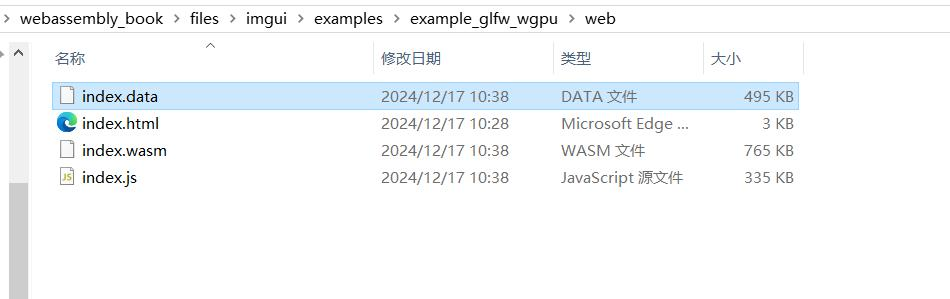
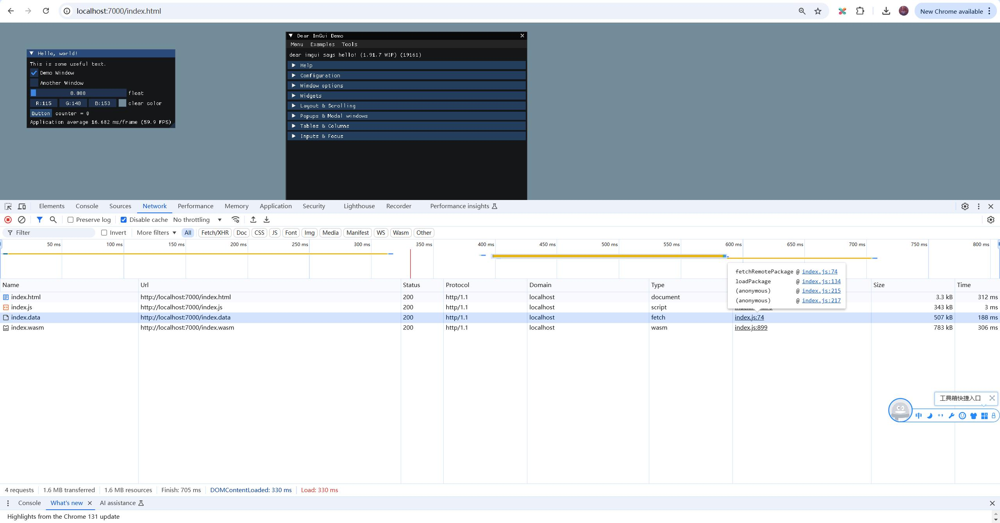
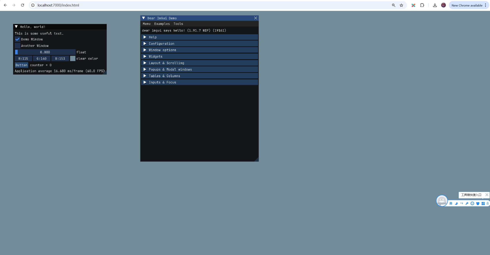

## 加载字体文件

Emscripten允许提前加载资源。

修改`files\imgui\examples\example_glfw_wgpu\Makefile.emscripten`

将`USE_FILE_SYSTEM ?= 0`修改为`USE_FILE_SYSTEM ?= 1`

```cmake
# Emscripten allows preloading a file or folder to be accessible at runtime.
# The Makefile for this example project suggests embedding the misc/fonts/ folder into our application, it will then be accessible as "/fonts"
# See documentation for more details: https://emscripten.org/docs/porting/files/packaging_files.html
# (Default value is 0. Set to 1 to enable file-system and include the misc/fonts/ folder as part of the build.)
USE_FILE_SYSTEM ?= 1
ifeq ($(USE_FILE_SYSTEM), 0)
LDFLAGS += -s NO_FILESYSTEM=1
CPPFLAGS += -DIMGUI_DISABLE_FILE_FUNCTIONS
endif
ifeq ($(USE_FILE_SYSTEM), 1)
LDFLAGS += --no-heap-copy --preload-file ../../misc/fonts@/fonts
endif
```

这样就会把`misc/fonts/`目录加载进来。

然后修改代码`files\imgui\examples\example_glfw_wgpu\main.cpp`，加载ttf文件：

```c++
    // Load Fonts
    // - If no fonts are loaded, dear imgui will use the default font. You can also load multiple fonts and use ImGui::PushFont()/PopFont() to select them.
    // - AddFontFromFileTTF() will return the ImFont* so you can store it if you need to select the font among multiple.
    // - If the file cannot be loaded, the function will return a nullptr. Please handle those errors in your application (e.g. use an assertion, or display an error and quit).
    // - The fonts will be rasterized at a given size (w/ oversampling) and stored into a texture when calling ImFontAtlas::Build()/GetTexDataAsXXXX(), which ImGui_ImplXXXX_NewFrame below will call.
    // - Use '#define IMGUI_ENABLE_FREETYPE' in your imconfig file to use Freetype for higher quality font rendering.
    // - Read 'docs/FONTS.md' for more instructions and details.
    // - Remember that in C/C++ if you want to include a backslash \ in a string literal you need to write a double backslash \\ !
    // - Emscripten allows preloading a file or folder to be accessible at runtime. See Makefile for details.
    //io.Fonts->AddFontDefault();
#ifndef IMGUI_DISABLE_FILE_FUNCTIONS
    //io.Fonts->AddFontFromFileTTF("fonts/segoeui.ttf", 18.0f);
    //io.Fonts->AddFontFromFileTTF("fonts/DroidSans.ttf", 16.0f);
    //io.Fonts->AddFontFromFileTTF("fonts/Roboto-Medium.ttf", 16.0f);
    //io.Fonts->AddFontFromFileTTF("fonts/Cousine-Regular.ttf", 15.0f);
    //io.Fonts->AddFontFromFileTTF("fonts/ProggyTiny.ttf", 10.0f);
    //ImFont* font = io.Fonts->AddFontFromFileTTF("fonts/ArialUni.ttf", 18.0f, nullptr, io.Fonts->GetGlyphRangesJapanese());
    //IM_ASSERT(font != nullptr);
#endif
```

把注释打开。

```c++
    // Load Fonts
    // - If no fonts are loaded, dear imgui will use the default font. You can also load multiple fonts and use ImGui::PushFont()/PopFont() to select them.
    // - AddFontFromFileTTF() will return the ImFont* so you can store it if you need to select the font among multiple.
    // - If the file cannot be loaded, the function will return a nullptr. Please handle those errors in your application (e.g. use an assertion, or display an error and quit).
    // - The fonts will be rasterized at a given size (w/ oversampling) and stored into a texture when calling ImFontAtlas::Build()/GetTexDataAsXXXX(), which ImGui_ImplXXXX_NewFrame below will call.
    // - Use '#define IMGUI_ENABLE_FREETYPE' in your imconfig file to use Freetype for higher quality font rendering.
    // - Read 'docs/FONTS.md' for more instructions and details.
    // - Remember that in C/C++ if you want to include a backslash \ in a string literal you need to write a double backslash \\ !
    // - Emscripten allows preloading a file or folder to be accessible at runtime. See Makefile for details.
    // io.Fonts->AddFontDefault();
#ifndef IMGUI_DISABLE_FILE_FUNCTIONS
    printf("Loading fonts...\n");
    // io.Fonts->AddFontFromFileTTF("fonts/segoeui.ttf", 18.0f);
    // io.Fonts->AddFontFromFileTTF("fonts/DroidSans.ttf", 16.0f);
    // io.Fonts->AddFontFromFileTTF("fonts/Roboto-Medium.ttf", 16.0f);
    // io.Fonts->AddFontFromFileTTF("fonts/Cousine-Regular.ttf", 15.0f);
    // io.Fonts->AddFontFromFileTTF("fonts/ProggyTiny.ttf", 10.0f);
    // ImFont* font = io.Fonts->AddFontFromFileTTF("fonts/ArialUni.ttf", 18.0f, nullptr, io.Fonts->GetGlyphRangesJapanese());

    io.Fonts->AddFontFromFileTTF("fonts/JetBrainsMonoNL-Light.ttf", 20.0f);
    io.Fonts->AddFontFromFileTTF("fonts/xkcd-script.ttf", 20.0f);
    printf("Loaded fonts\n");
    // IM_ASSERT(font != nullptr);
#endif
```

再编译

```
F:\webassembly_book\files\imgui\examples\example_glfw_wgpu>"C:\Program Files\JetBrains\CLion 2023.3.4\bin\mingw\bin\mingw32-make.exe" -f Makefile.emscripten
process_begin: CreateProcess(NULL, uname -s, ...) failed.
Makefile.emscripten:25: pipe: No error
em++ -o web/index.js main.o imgui.o imgui_demo.o imgui_draw.o imgui_tables.o imgui_widgets.o imgui_impl_glfw.o imgui_impl_wgpu.o -s USE_GLFW=3 -s USE_WEBGPU=1 -s WASM=1 -s ALLOW_MEMORY_GROWTH=1 -s NO_EXIT_RUNTIME=0 -s ASSERTIONS=1 --no-heap-copy --preload-file ../../misc/fonts@/fonts -s DISABLE_EXCEPTION_CATCHING=1
cache:INFO: generating system asset: symbol_lists/df5494f4a0f73bd6293585a500779572f463ca4f.json... (this will be cached in "F:\emsdk\upstream\emscripten\cache\symbol_lists\df5494f4a0f73bd6293585a500779572f463ca4f.json" for subsequent builds)
cache:INFO:  - ok
Build complete for web/index.js
```

有时候编译不会生效，可以删除web目录中的index.wasm  和 index.js再编译。

从编译log可以看到，相比之前的，多了`--preload-file ../../misc/fonts@/fonts`。

然后在web目录中，多了`index.data`这个文件。



启动http服务器：

```
F:\webassembly_book\files\imgui\examples\example_glfw_wgpu>cd web

F:\webassembly_book\files\imgui\examples\example_glfw_wgpu\web>emrun index.html --port 7000
Now listening at http://0.0.0.0:7000/
```

emsdk自带的http服务器在出现异常时会卡住，我换成使用python自带的http服务器：

```
Microsoft Windows [Version 10.0.19045.5131]
(c) Microsoft Corporation. All rights reserved.

C:\Users\captainchen>f:

F:\>cd F:\webassembly_book\files\imgui\examples\example_glfw_wgpu\web

F:\webassembly_book\files\imgui\examples\example_glfw_wgpu\web>python -m http.server 7000
Serving HTTP on :: port 7000 (http://[::]:7000/) ...
```

在浏览器中看到请求了`index.data`






