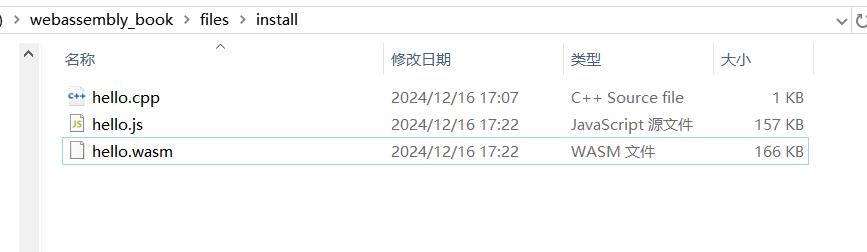
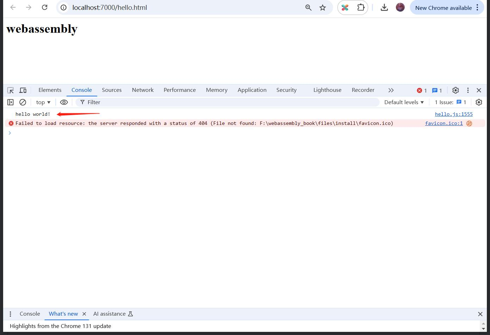
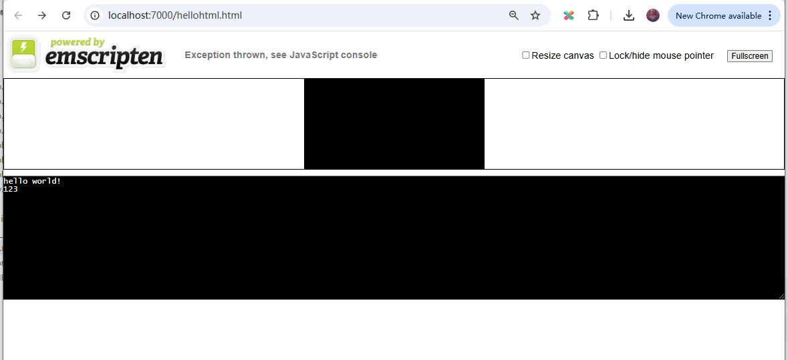

## 安装emsdk

官方文档：`https://emscripten.org/docs/getting_started/downloads.html`

### 1. 安装

Linux按照下面的命令操作就行。

```
# Get the emsdk repo
git clone https://github.com/emscripten-core/emsdk.git

# Enter that directory
cd emsdk

# Fetch the latest version of the emsdk (not needed the first time you clone)
git pull

# Download and install the latest SDK tools.
./emsdk install latest

# Make the "latest" SDK "active" for the current user. (writes .emscripten file)
./emsdk activate latest

# Activate PATH and other environment variables in the current terminal
source ./emsdk_env.sh
```

Windows需要将上面的`./emsdk`替换成`emsdk.bat`，将`source ./emsdk_env.sh`替换为`emsdk_env.bat`。

安装完成后，输入`emcc -v`查看版本信息：

```
F:\emsdk>emcc -v
emcc (Emscripten gcc/clang-like replacement + linker emulating GNU ld) 3.1.74 (1092ec30a3fb1d46b1782ff1b4db5094d3d06ae5)
clang version 20.0.0git (https:/github.com/llvm/llvm-project 322eb1a92e6d4266184060346616fa0dbe39e731)
Target: wasm32-unknown-emscripten
Thread model: posix
InstalledDir: F:\emsdk\upstream\bin
```

### 2. 编译cpp为wasm

每次打开一个cmd窗口，都需要重新设置好环境变量，执行下面命令：

```
source ./emsdk_env.sh
```

Windows则换成下面命令：

```
F:\>cd emsdk

F:\emsdk>emsdk_env.bat
```

然后再切到cpp所在的目录进行编译：

```c++
F:\>cd webassembly_book\files\install

F:\webassembly_book\files\install>em++ hello.cpp -o hello.js
```

编译得到`hello.js` `hello.wasm` 两个文件。



### 3. 运行wasm

写的cpp代码被编译成了webassembly，那么就需要在浏览器中去运行这个代码。

浏览器是用来浏览网页的，它的入口是html，所以得先搞个html，然后加载执行`hello.js`。

然后`hello.js`会自动加载执行`hello.wasm`。

仍然在上面设置好的环境变量的控制台里，执行命令启动一个http服务器：

```c++
F:\webassembly_book\files\install>emrun hello.html --port 7000
Now listening at http://0.0.0.0:7000/
```

会自动打开浏览器访问`http://localhost:7000/hello.html`，F12打开浏览器控制台，可以看到输出了`hello world!`。



上面的`hello.html`是自己写的超简单的，也可以用下面的命令，让emsdk自动生成一个html。

```c++
F:\webassembly_book\files\install>em++ hello.cpp -o hellohtml.html
```

这样就得到了`hellohtml.html`  `hellohtml.js`  `hellohtml.wasm` 全套文件。

启动http服务器：

```
F:\webassembly_book\files\install>emrun hellohtml.html --port 7000
Now listening at http://0.0.0.0:7000/
```

是一个比较完善的网页，带了控制台可以显示输出。




